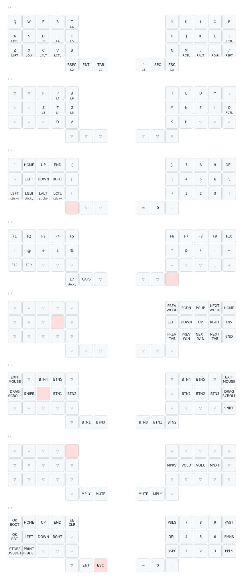

# KB2040 controller charybdis 3x5+3 support

Drop this repo into qmk_firmware/keyboards/pfn/charybdis/

Supports:

* KB2040
* Cirque Glidepoint
* Encoder
* Other firmware niceties

### Layout

##### Generate layout image
$ `keymap parse -q keymaps/pfn/pfn.json | sed -E 's/ANY\((.*)\)/\1/' | keymap draw - > layout.svg`

with https://github.com/caksoylar/keymap-drawer

##### Notes

This is all used in conjunction with my userspace at https://github.com/pfn/qmk_userspace